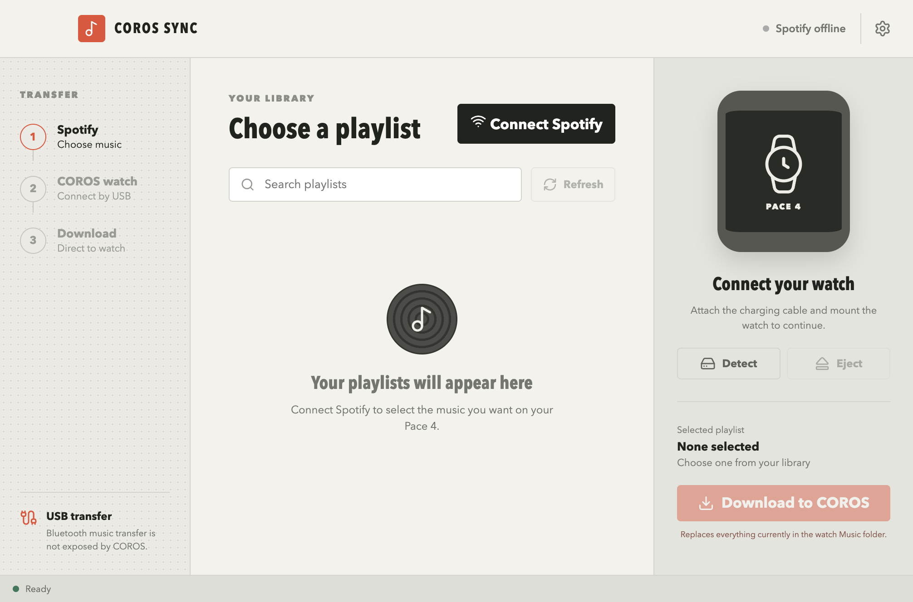

# COROS Sync

A macOS desktop app that copies music from a Spotify playlist to a mounted COROS watch. It reads playlist metadata from Spotify, uses `yt-dlp` and FFmpeg to obtain MP3 files, and writes them to the watch over USB.



## Requirements

- macOS
- Node.js and npm
- A COROS watch that mounts as a USB volume
- A Spotify account and Spotify developer app
- `yt-dlp` and FFmpeg

## Install

1. Clone the repository and install the JavaScript dependencies:

   ```sh
   git clone https://github.com/jacobmalone28/coros-spotify-sync.git
   cd coros-spotify-sync
   npm install
   ```

2. Install the media tools:

   ```sh
   brew install ffmpeg pipx
   pipx install yt-dlp
   ```

3. In the [Spotify Developer Dashboard](https://developer.spotify.com/dashboard), create an app and add this redirect URI:

   ```text
   http://127.0.0.1:43821/callback
   ```

   Copy the app's client ID. A client secret is not required because COROS Sync uses OAuth PKCE.

4. Start the desktop app:

   ```sh
   npm run desktop:dev
   ```

5. Open **Settings**, paste the Spotify client ID, and save.

## Use

1. Select **Connect Spotify** and approve playlist access in the browser.
2. Attach the COROS watch with its charging cable and wait for it to mount.
3. Select **Detect**. If automatic detection fails, choose the mounted volume in **Settings**.
4. Choose a Spotify playlist and select **Download to COROS**.
5. Wait for the transfer to finish, then select **Eject** before disconnecting the watch.

> [!WARNING]
> A sync removes everything currently in the watch's `Music` folder before writing the selected playlist.

Downloaded tracks are cached in `~/Music/Coros Sync` by default. Change the download library in **Settings** if needed.

## Privacy and credentials

COROS Sync never requires a Spotify client secret. The client ID and local paths are stored in the app's per-user data directory, outside this repository. The Spotify refresh token is encrypted with Electron's macOS secure storage, and access tokens remain in memory.

Do not commit `.env` files, credential exports, or local cache files. They are excluded by the repository's `.gitignore`.

## Build

```sh
npm run build
npm run package:mac
```

The unpacked macOS application is produced by `electron-builder`; packaging output is excluded from Git.

## Limitations

COROS does not publish a Bluetooth file-transfer API for music, so transfers require the watch's mounted USB storage. Watch Bluetooth support is intended for audio peripherals and media controls.

Spotify supplies playlist metadata only. `yt-dlp` retrieves audio from third-party providers; use the app only for media you have permission to download and follow the applicable service terms.
